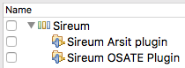

# Github hosted Sireum OSATE Plugin Update Site

Built against Sireum Kekinian Build 4.20210504.a32d781 - To install Kekinian see [https://github.com/sireum/kekinian/tree/a32d781#installing](https://github.com/sireum/kekinian/tree/a32d781#installing)

## Installation
1. Install and launch [OSATE](http://osate.org/download-and-install.html)
2. Navigate to ``Help > Install New Software ...``
3. Click ``Add...`` and in the ``Location:`` field paste the following URL

    https://raw.githubusercontent.com/sireum/osate-plugin-update-site/master/
  
4. Expand the ``Sireum`` option and select the tools you want to install then click ``Finish``

   
